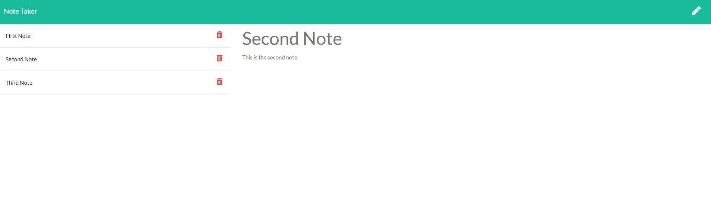

# NoteTaker

## Table of Contents
[Description](#description)

[Installation](#installation)

[Usage](#usage)

[Credits](#credits)

## Description
This repository contains a web app that allows the user to save notes unto a server json file. The user can delete notes the have created and notes are persistent across different locations. This web app required routing and ajax calls. An image of the notes route is pictured below.

### NoteScreen

## Installation
Downloading respository. In directory run npm install.

## Usage
After installation npm run start ore node server.js. You can view notes by clicking on them. Delete notes by clicking the red icon to the left of them. Create a new note by typing the pencil icon and then the save icon after writing the note. This repository is deployed to heroku at https://tranquil-beach-76430.herokuapp.com/.

## Credits
Made By Andrew Ehrman.

### Components Used
Node

npm packages
express

